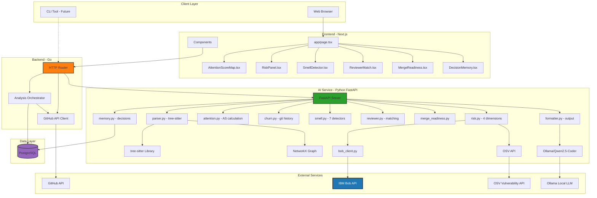
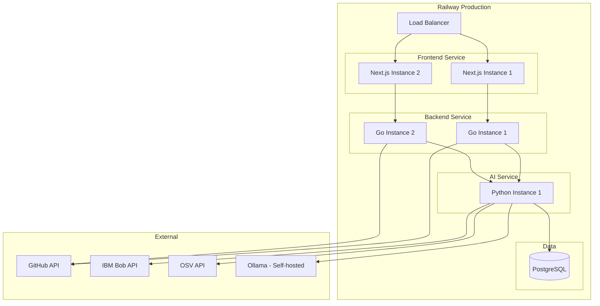

# PRism Architecture

## System Overview

PRism is a three-tier architecture designed for high-throughput PR analysis with minimal latency. The system processes GitHub pull requests through a coordinated pipeline: a Go backend handles HTTP routing and GitHub API orchestration, a Python AI service performs compute-intensive analysis (AST parsing, graph traversal, risk scoring, LLM inference), and PostgreSQL stores persistent decision memory and team configuration.

**Key Design Principles:**
1. **Separation of Concerns** — Go handles I/O-bound GitHub API calls concurrently; Python handles CPU-bound analysis sequentially
2. **Stateless Services** — Both Go and Python services are horizontally scalable; all state lives in PostgreSQL
3. **Fail-Fast Validation** — Input validation happens at the Go layer before expensive AI processing
4. **Incremental Analysis** — Each analysis component (AST, graph, risk, churn) can fail independently without blocking others

---

## Component Architecture



---

## Data Flow — PR Analysis

When a user pastes a GitHub PR URL and clicks "Analyze", the following 15-step process executes:

### Step-by-Step Flow

1. **Frontend Validation** — Next.js validates URL format matches `https://github.com/{owner}/{repo}/pull/{number}`

2. **POST /analyze Request** — Frontend sends JSON to Go backend:
   ```json
   {
     "url": "https://github.com/facebook/react/pull/28000",
     "options": {
       "include_decision_memory": true,
       "risk_threshold": 0.6
     }
   }
   ```

3. **Go Backend Receives Request** — Router extracts owner, repo, PR number from URL

4. **GitHub API — Fetch PR Metadata** — Go makes concurrent API calls:
   - `GET /repos/{owner}/{repo}/pulls/{number}` — PR title, description, author, created_at
   - `GET /repos/{owner}/{repo}/pulls/{number}/files` — Changed files with diffs
   - `GET /repos/{owner}/{repo}/pulls/{number}/commits` — Commit history
   - `GET /repos/{owner}/{repo}/pulls/{number}/reviews` — Past review history

5. **GitHub API — Clone Repository Context** — Go fetches:
   - `GET /repos/{owner}/{repo}` — Repository metadata (language, size, default branch)
   - `GET /repos/{owner}/{repo}/contents/` — Root directory structure
   - Dependency manifests if present (package.json, go.mod, requirements.txt)

6. **Assemble Analysis Request** — Go backend constructs payload for Python AI service:
   ```json
   {
     "pr_number": 28000,
     "repository": {
       "owner": "facebook",
       "name": "react",
       "default_branch": "main",
       "language": "JavaScript"
     },
     "files": [
       {
         "filename": "packages/react-dom/src/client/ReactDOM.js",
         "status": "modified",
         "additions": 47,
         "deletions": 12,
         "patch": "@@ -1,5 +1,5 @@\n import React from 'react';\n..."
       }
     ],
     "commits": [...],
     "reviews": [...]
   }
   ```

7. **POST /process to Python AI Service** — Go sends assembled payload

8. **Python AI — Parse AST** — `parser.py` uses tree-sitter to:
   - Parse each changed file into Abstract Syntax Tree
   - Extract imports, function definitions, class declarations
   - Build import dependency graph using NetworkX
   - Identify module boundaries and service layers

9. **Python AI — Compute Risk Dimensions** — `risk.py` calculates in parallel:
   - **Security Risk R(f)** — Pattern matching against security rules (SQL injection, XSS, auth bypass, crypto misuse)
   - **Blast Radius D(f)** — Graph traversal to count direct and transitive dependents
   - **Dependency Risk** — Check new/updated packages against OSV API for known CVEs
   - **Architectural Risk** — Call IBM Bob with full repo context to analyze pattern consistency

10. **Python AI — Compute Code Churn C(f)** — `churn.py` analyzes git history:
    - Count commits touching each file in last 90 days
    - Calculate bug fix ratio (commits with "fix", "bug", "patch" in message)
    - Compute instability score

11. **Python AI — Calculate Attention Scores** — `attention.py` computes:
    ```
    AS(f) = 0.40 · R(f) + 0.35 · D(f) + 0.25 · C(f)
    ```
    - Includes confidence interval based on data completeness
    - Labels each file (CRITICAL / HIGH / MEDIUM / LOW / SKIP)

12. **Python AI — Detect PR Smells** — `smell.py` runs 7 detectors:
    - PR Too Large (>400 lines)
    - God PR (>3 functional domains)
    - No Tests Added (logic changed, no test files)
    - Thin Description (<50 words for >200 lines)
    - Merge Conflict Risk (same files in 3+ open PRs)
    - High Churn File with No Review (C(f) > 0.7, no senior reviewer)
    - Friday Merge Risk (after 3pm Friday local time)

13. **Python AI — Generate Review Brief** — `formatter.py` calls Ollama/Qwen:
    - Prompt: "Summarize this PR in 5 sections: Change Summary, Focus Areas, Tradeoffs Made, What To Skip, Open Questions"
    - Input: PR description + diff + attention scores + risk analysis
    - Output: Structured markdown brief

14. **Python AI — Store Decision Memory** — `memory.py` writes to PostgreSQL:
    ```sql
    INSERT INTO decisions (
      pr_number, repository, decision_summary, reasoning,
      alternatives_rejected, affected_components, risk_accepted,
      reviewer_signoff, tags, created_at
    ) VALUES (...)
    ```

15. **Return Complete Analysis** — Python returns JSON to Go, Go returns to Frontend:
    ```json
    {
      "review_brief": {...},
      "risk_intelligence": {...},
      "attention_scores": [...],
      "pr_smells": [...],
      "reviewer_recommendations": [...],
      "merge_readiness": {...},
      "processing_time_ms": 3847
    }
    ```

---

## Service Responsibilities

### Frontend (Next.js)

| Responsibility | Implementation |
|----------------|----------------|
| **URL Input & Validation** | Regex validation of GitHub PR URLs before API call |
| **Analysis Trigger** | POST request to Go backend with user options |
| **Result Visualization** | Six component panels rendering analysis output |
| **Attention Score Map** | Color-coded file list with confidence intervals |
| **Risk Panel** | Four-dimension risk display with severity indicators |
| **Decision Memory Search** | Semantic search interface for past decisions |
| **Responsive Design** | Mobile-friendly layout with Tailwind CSS |

**Key Files:**
- `app/page.tsx` — Main analysis page with URL input
- `components/AttentionScoreMap.tsx` — Per-file score visualization
- `components/RiskPanel.tsx` — Four-dimension risk display
- `components/SmellDetector.tsx` — PR smell flags with recommendations
- `components/ReviewerMatch.tsx` — Recommended reviewers with reasoning
- `components/MergeReadiness.tsx` — Green/Yellow/Red merge gate
- `components/DecisionMemory.tsx` — Semantic search for past decisions

---

### Backend (Go)

| Responsibility | Implementation |
|----------------|----------------|
| **HTTP Routing** | Gin framework with CORS middleware |
| **GitHub API Client** | Concurrent API calls using goroutines |
| **Rate Limit Handling** | Exponential backoff with retry logic |
| **Request Orchestration** | Assembles data from GitHub, calls Python AI, returns result |
| **Error Handling** | Structured error responses with HTTP status codes |
| **Health Checks** | `/health` endpoint for monitoring |

**Key Files:**
- `main.go` — HTTP server, routes, middleware
- `github/client.go` — GitHub API wrapper with authentication
- `github/pr.go` — PR-specific API calls (files, commits, reviews)
- `orchestrator/analyze.go` — Coordinates GitHub fetch + AI processing

**Why Go?**
- Goroutines enable concurrent GitHub API calls (fetch PR + files + commits + reviews in parallel)
- Single binary deployment — no runtime dependencies
- Fast startup time — critical for serverless deployment
- Strong standard library for HTTP and JSON

---

### AI Service (Python FastAPI)

| Responsibility | Implementation |
|----------------|----------------|
| **AST Parsing** | tree-sitter for multi-language support |
| **Dependency Graph** | NetworkX for import graph and centrality |
| **Risk Analysis** | Four independent risk calculators |
| **Attention Scoring** | Mathematical formula with confidence intervals |
| **Code Churn Analysis** | Git log parsing and bug fix ratio |
| **PR Smell Detection** | Seven rule-based detectors |
| **Reviewer Matching** | Historical review analysis |
| **Merge Readiness** | Seven-condition gate logic |
| **Review Brief Generation** | Ollama/Qwen LLM prompting |
| **Decision Memory** | PostgreSQL storage with semantic search |
| **IBM Bob Integration** | Architectural risk analysis |

**Key Files:**
- `main.py` — FastAPI server with `/process`, `/search`, `/health` endpoints
- `bob_client.py` — IBM Bob session management and prompting
- `parser.py` — tree-sitter AST parsing + NetworkX graph building
- `risk.py` — Security, Blast Radius, Dependency, Architectural risk
- `attention.py` — AS(f) calculation with confidence intervals
- `churn.py` — Git history analysis for instability scoring
- `smell.py` — Seven PR smell detectors
- `reviewer.py` — Reviewer matching based on past review history
- `merge_readiness.py` — Seven-condition merge gate
- `memory.py` — Decision Memory storage and semantic search
- `formatter.py` — Assembles all outputs into final JSON response

**Why Python?**
- tree-sitter has excellent Python bindings
- NetworkX is the standard graph library
- IBM Bob SDK is Python-native
- Ollama has Python client library
- Rich ecosystem for AST analysis and NLP

---

### PostgreSQL Database

| Table | Purpose | Key Columns |
|-------|---------|-------------|
| **decisions** | Decision Memory storage | `pr_number`, `repository`, `decision_summary`, `reasoning`, `alternatives_rejected`, `affected_components`, `risk_accepted`, `reviewer_signoff`, `tags`, `created_at` |
| **pr_history** | Past PR analysis results | `pr_number`, `repository`, `attention_scores`, `risk_scores`, `smells_detected`, `analyzed_at` |
| **team_settings** | Per-team configuration | `team_id`, `risk_weights` (alpha/beta/gamma), `smell_thresholds`, `reviewer_pool` |
| **velocity_metrics** | Team performance tracking | `team_id`, `avg_review_time`, `rework_rate`, `merge_frequency`, `week_start` |

**Schema Design:**
- `decisions` table uses JSONB for flexible schema (alternatives, components, tags)
- Full-text search index on `decision_summary` and `reasoning` for fast semantic search
- Composite index on `(repository, created_at)` for timeline queries
- Foreign key from `pr_history` to `decisions` for linking analysis to decision

---

## API Contracts

### Go Backend → Python AI Service

**Endpoint:** `POST http://localhost:8000/process`

**Request:**
```json
{
  "pr_number": 28000,
  "repository": {
    "owner": "facebook",
    "name": "react",
    "default_branch": "main",
    "language": "JavaScript",
    "clone_url": "https://github.com/facebook/react.git"
  },
  "files": [
    {
      "filename": "packages/react-dom/src/client/ReactDOM.js",
      "status": "modified",
      "additions": 47,
      "deletions": 12,
      "patch": "@@ -1,5 +1,5 @@\n import React from 'react';\n...",
      "blob_url": "https://github.com/facebook/react/blob/..."
    }
  ],
  "commits": [
    {
      "sha": "abc123",
      "message": "Fix hydration bug in Suspense",
      "author": "gaearon",
      "date": "2026-05-15T10:30:00Z"
    }
  ],
  "reviews": [
    {
      "user": "sebmarkbage",
      "state": "APPROVED",
      "submitted_at": "2026-05-15T14:20:00Z",
      "body": "LGTM with one suggestion"
    }
  ],
  "options": {
    "include_decision_memory": true,
    "risk_threshold": 0.6,
    "alpha": 0.40,
    "beta": 0.35,
    "gamma": 0.25
  }
}
```

**Response:**
```json
{
  "review_brief": {
    "change_summary": "This PR fixes a hydration mismatch bug...",
    "focus_areas": [
      {
        "file": "packages/react-dom/src/client/ReactDOM.js",
        "lines": "247-289",
        "priority": "CRITICAL",
        "reason": "Core hydration logic with 14 dependents"
      }
    ],
    "tradeoffs_made": "Chose to add runtime check instead of...",
    "what_to_skip": ["docs/README.md", "packages/react/index.js"],
    "open_questions": [
      "Should we backport this to React 17?",
      "Does this affect Server Components?"
    ]
  },
  "risk_intelligence": {
    "security_risk": {
      "level": "LOW",
      "score": 0.12,
      "findings": []
    },
    "blast_radius": {
      "level": "HIGH",
      "score": 0.78,
      "direct_dependents": 14,
      "transitive_dependents": 47,
      "services_affected": ["react-dom", "react-native-web"]
    },
    "dependency_risk": {
      "level": "NONE",
      "score": 0.0,
      "new_packages": [],
      "cves_found": []
    },
    "architectural_risk": {
      "level": "MEDIUM",
      "score": 0.45,
      "bob_analysis": "This PR introduces a new runtime check pattern..."
    }
  },
  "attention_scores": [
    {
      "file": "packages/react-dom/src/client/ReactDOM.js",
      "score": 0.91,
      "confidence_interval": 0.04,
      "label": "CRITICAL",
      "components": {
        "risk": 0.34,
        "dependency": 0.39,
        "churn": 0.18
      }
    }
  ],
  "pr_smells": [
    {
      "type": "HIGH_CHURN_NO_REVIEW",
      "severity": "MEDIUM",
      "message": "ReactDOM.js has high churn (C=0.72) but no senior reviewer assigned",
      "recommendation": "Request review from @sebmarkbage or @gaearon"
    }
  ],
  "reviewer_recommendations": [
    {
      "username": "sebmarkbage",
      "reason": "Reviewed 8 past PRs touching ReactDOM.js with avg 12 comments per review",
      "confidence": 0.89,
      "availability": "2 open PRs currently reviewing"
    }
  ],
  "merge_readiness": {
    "status": "YELLOW",
    "score": 0.67,
    "blocking_reasons": [
      "ReactDOM.js (AS=0.91, CRITICAL) has 0 review comments"
    ],
    "passing_checks": [
      "CI passing",
      "2 approvals received",
      "All comments resolved"
    ]
  },
  "processing_time_ms": 3847,
  "metadata": {
    "bob_session_id": "sess_abc123",
    "ollama_model": "qwen2.5-coder:7b",
    "tree_sitter_languages": ["javascript", "typescript"],
    "graph_nodes": 847,
    "graph_edges": 1203
  }
}
```

---

## Deployment Architecture



**Scaling Strategy:**
- Frontend and Go backend are stateless — horizontal scaling via Railway autoscaling
- Python AI service is CPU-bound — vertical scaling (more cores) preferred over horizontal
- PostgreSQL uses Railway managed instance with automatic backups
- Ollama runs on dedicated GPU instance (Railway GPU plan or separate host)

**Resource Estimates (MVP):**
- Frontend: 512MB RAM, 0.5 CPU
- Go Backend: 256MB RAM, 0.25 CPU
- Python AI: 2GB RAM, 2 CPU (4 CPU for faster analysis)
- PostgreSQL: 1GB RAM, 10GB storage
- Ollama: 8GB RAM, 4GB VRAM (for Qwen2.5-Coder 7B)

---

## Security Considerations

| Layer | Security Measure |
|-------|------------------|
| **API Authentication** | GitHub Personal Access Token with minimal scopes (read:repo, read:user) |
| **Rate Limiting** | 100 requests/hour per IP address on Go backend |
| **Input Validation** | URL regex validation, PR number bounds checking |
| **SQL Injection Prevention** | Parameterized queries only, no string concatenation |
| **Secrets Management** | Environment variables, never committed to git |
| **CORS Policy** | Whitelist frontend domain only |
| **IBM Bob API Key** | Stored in environment, rotated monthly |
| **PostgreSQL Access** | TLS-only connections, strong password policy |

---

## Performance Targets

| Metric | Target | Measurement |
|--------|--------|-------------|
| **PR Analysis Latency** | < 5 seconds for PRs with <10 files | P95 response time |
| **Concurrent Requests** | 50 simultaneous analyses | Load test with Locust |
| **GitHub API Rate Limit** | Stay under 5000 requests/hour | Monitoring dashboard |
| **Database Query Time** | < 100ms for Decision Memory search | PostgreSQL slow query log |
| **Frontend Load Time** | < 2 seconds initial page load | Lighthouse score >90 |

---

## Monitoring & Observability

**Metrics to Track:**
- Request count and latency per endpoint
- GitHub API rate limit remaining
- Python AI service processing time breakdown (AST, graph, risk, LLM)
- PostgreSQL connection pool utilization
- Ollama inference time per request
- Error rate by component

**Logging Strategy:**
- Structured JSON logs with request ID for tracing
- Log levels: DEBUG (development), INFO (production), ERROR (always)
- Centralized logging via Railway logs or external service (Datadog, Sentry)

**Health Checks:**
- `GET /health` on all services returns 200 if healthy
- Checks: database connection, GitHub API reachable, Ollama responding

---

## Future Architecture Enhancements

1. **Caching Layer** — Redis for frequently analyzed PRs (same PR analyzed multiple times)
2. **Async Processing** — Queue-based architecture for long-running analyses (Celery + RabbitMQ)
3. **Multi-Repo Analysis** — Cross-repository Decision Memory search
4. **Real-time Updates** — WebSocket connection for streaming analysis progress
5. **GitHub App** — Webhook-based automatic analysis on PR open/update
6. **Team Analytics** — Aggregated metrics dashboard (velocity, review time, rework rate)

---

**Architecture designed for:** 48-hour hackathon build → production-ready scaling path.